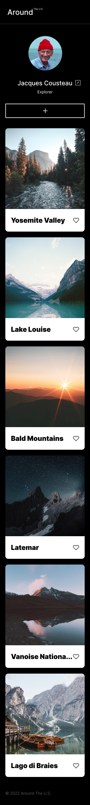

# Project 3: Around The U.S.

https://neil802.github.io/se_project_aroundtheus/

### Overview

- Intro
- Figma
- Images
- Video

**Intro**

Depending on the device and screen size, I utilize new techniques and methods to design a responsive page.

**Figma**

- [Link to the project on Figma](https://www.figma.com/file/ii4xxsJ0ghevUOcssTlHZv/Sprint-3%3A-Around-the-US?node-id=0%3A1)

**Images**

  

**Video**

- [Link to video explaining project](https://drive.google.com/file/d/1C3eaBF5FgsmuFMJxZAfbt5K93D-DUOgX/view?usp=sharing)
